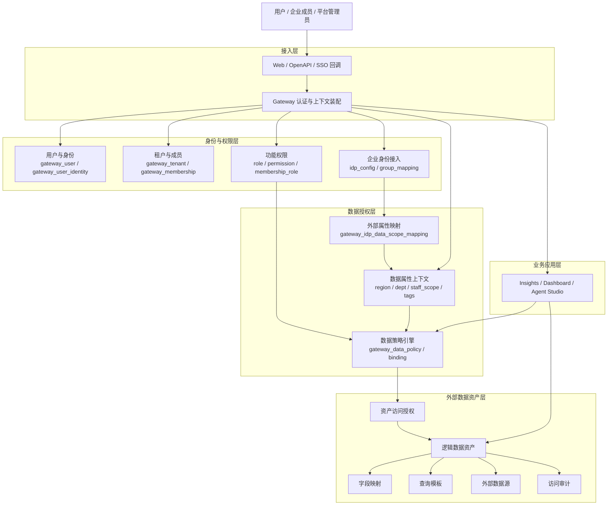
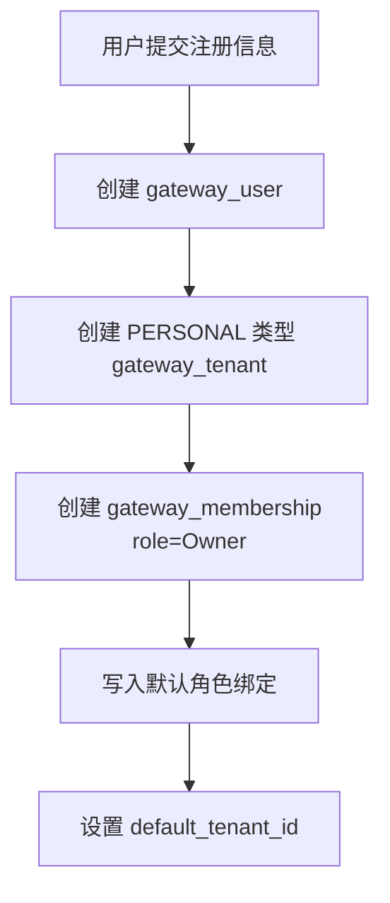
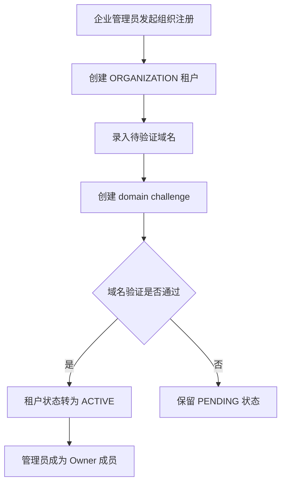
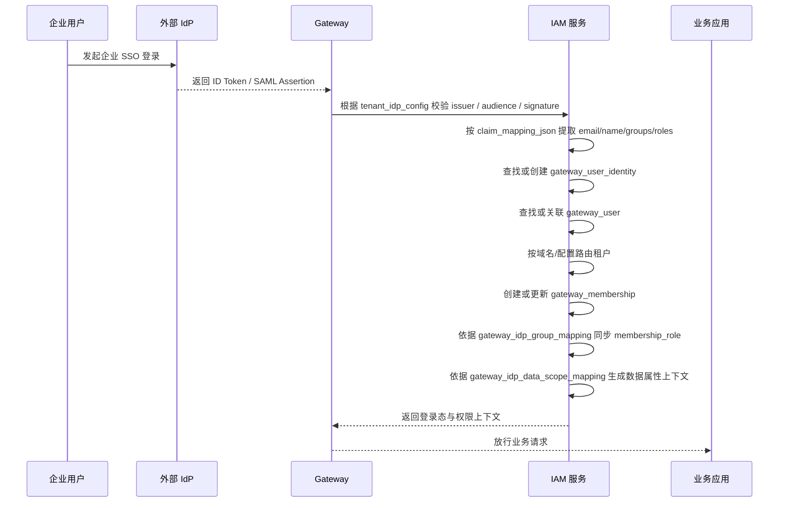
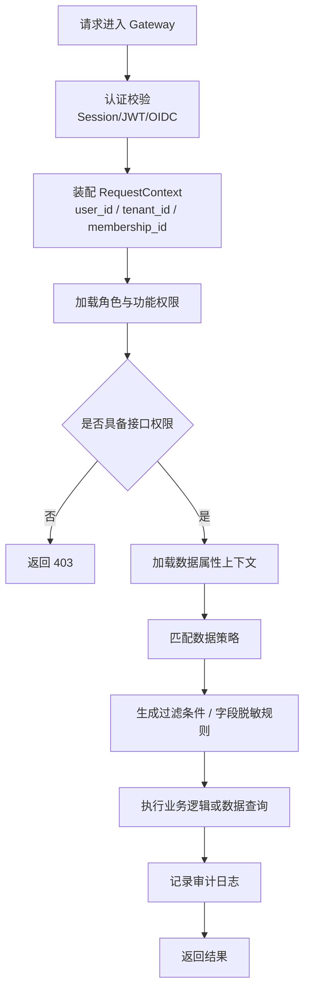
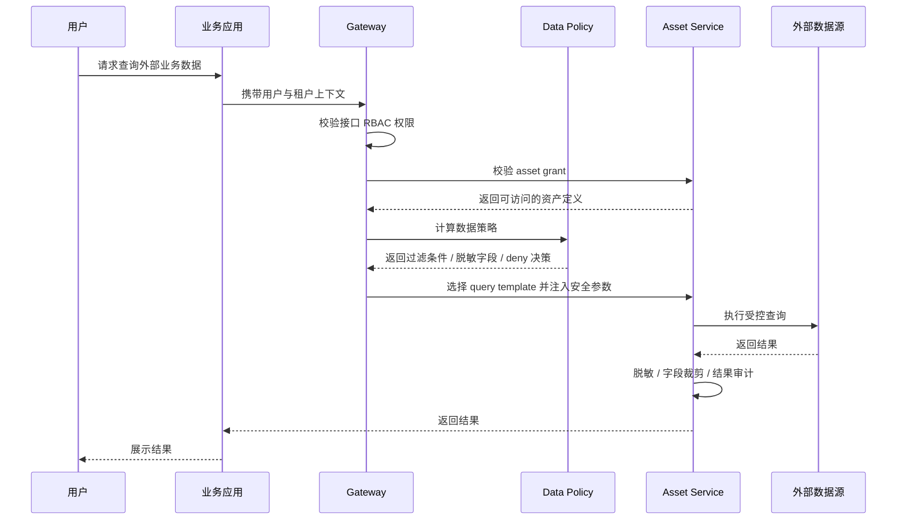
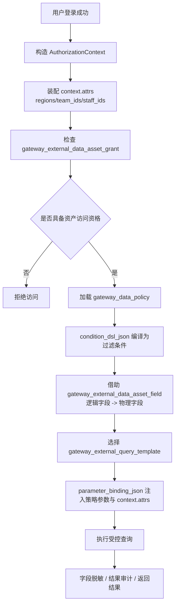

# Gateway 权限体系架构设计

---

## 1. 文档目标

基于以下三份表结构初稿，形成一套可落地的权限体系架构设计，覆盖身份、租户、认证、授权、数据权限、外部数据资产接入与审计：

- `/Users/zhaoshan/workspace/imorph-projects/ai-chat-insight/docs/sql/20260825-Gateway-Tenant-IAM-schema-mysql.sql`
- `/Users/zhaoshan/workspace/imorph-projects/ai-chat-insight/docs/sql/20260825-Gateway-Data-Policy-schema-mysql.sql`
- `/Users/zhaoshan/workspace/imorph-projects/ai-chat-insight/docs/sql/20260825-Gateway-External-Data-Asset-schema-mysql.sql`

本设计稿的目标不是只给出表，而是把三份 DDL 串成一套完整的权限体系方案，回答以下问题：

1. 系统如何表达“人、组织、身份、角色、权限、数据范围、外部数据资产”之间的关系。
2. 一个用户从注册、登录、加入租户、获得角色，到最终访问业务数据时，系统如何做鉴权与授权。
3. 当系统未来面向外部客户开放、支持企业 SSO、支持独立部署与外部数据接入时，权限体系如何保持可扩展。

---

## 2. 设计范围

本次设计覆盖以下五个子域：

1. 身份与租户域
   - 用户、企业租户、个人租户、成员关系、租户域名、邀请、加入申请。
2. 认证接入域
   - 本地账号、企业 SSO、外部身份映射、Claim 映射、IdP Group 到内部角色映射。
3. 功能授权域
   - RBAC 角色、权限点、成员角色绑定。
4. 数据权限域
   - 按租户、成员、角色控制可见数据范围、字段脱敏、拒绝访问。
5. 外部数据资产域
   - 外部数据源、逻辑数据资产、字段映射、查询模板、访问授权、审计。

本次设计不直接覆盖：

- 具体页面交互细节。
- 各业务模块自身的对象级授权规则实现细节。
- 复杂工作流引擎、审批流引擎的完整实现。

---

## 3. 核心设计原则

### 3.1 身份与组织解耦

`User` 表示“自然人账号”，`Tenant` 表示“组织或个人工作空间”，`Membership` 表示“某个用户在某个租户中的成员关系”。  
这三者必须拆开，不能继续把“用户”与“租户”硬绑定在同一实体上。

### 3.2 认证与授权解耦

认证回答“你是谁”，授权回答“你能做什么”。  
因此本设计将 `gateway_user_identity`、`gateway_tenant_idp_config` 放在认证接入侧，将 `gateway_role`、`gateway_permission`、`gateway_membership_role` 放在授权侧。

### 3.3 功能权限与数据权限分层

RBAC 决定“能不能进入某个能力”。  
Data Policy 决定“进来之后能看到哪些数据、哪些字段要脱敏、哪些记录要被过滤”。  
两者不能混成一套。

### 3.4 内部模型稳定，外部系统适配

无论外部接入的是本地注册、OIDC、SAML，还是外部业务数据库、ES、HTTP API，平台内部都只维护统一的抽象：

- 统一的用户与租户模型。
- 统一的角色与权限模型。
- 统一的数据策略 DSL。
- 统一的外部数据资产抽象。

### 3.5 默认最小权限

无论是功能权限还是数据权限，都遵循默认拒绝原则：

- 没有角色，不授予功能能力。
- 没有数据授权，不允许访问外部数据资产。
- 没有命中数据策略时，按默认安全策略执行。

---

## 4. 总体架构

### 4.1 分层视图



### 4.2 职责边界

1. Gateway 负责统一接入、认证校验、租户与成员上下文装配、角色与权限加载。
2. IAM 层负责“你是谁、你属于哪个租户、你拥有哪些功能权限”。
3. Data Policy 层负责“你能看到哪些数据、哪些字段要被掩码、哪些范围需要过滤”。
4. External Data Asset 层负责“平台如何以受控方式接入外部业务数据，而不是直接裸连客户生产表”。
5. 业务应用只消费“已授权上下文”，尽量不直接硬编码权限逻辑。

---

## 5. 核心实体设计

### 5.1 身份与租户

- `gateway_user`
  - 自然人账号主体。
  - 可同时拥有多个登录身份。
  - 可加入多个租户。

- `gateway_tenant`
  - 平台的租户主体。
  - 可区分 `PERSONAL` 与 `ORGANIZATION`。
  - 企业客户、个人空间、独立部署客户都统一抽象为租户。

- `gateway_membership`
  - 表示用户与租户之间的关系。
  - 负责承载成员状态、加入来源、默认租户身份等信息。
  - 是角色绑定、邀请、审批、审计的核心落点。

- `gateway_tenant_domain`
  - 企业租户绑定的邮箱域名、SSO 域名或组织域名。
  - 用于租户路由、企业归属识别。

- `gateway_tenant_domain_challenge`
  - 域名归属挑战记录。
  - 用于自助式企业接入时证明某个域名确实属于该租户。

### 5.2 认证接入

- `gateway_user_identity`
  - 存放本地账号、OIDC、SAML 等外部身份与内部用户的映射。
  - 一个用户可有多个 identity。

- `gateway_tenant_idp_config`
  - 企业租户的 SSO 配置。
  - 记录 issuer、client_id、claim_mapping_json、jit 策略等。

- `gateway_idp_group_mapping`
  - 将外部 IdP 的 group 或 role 映射为内部角色。
  - 当前设计为纯 RBAC，不再引入内部 group 模型。

### 5.3 功能授权

- `gateway_role`
  - 租户内角色定义，如 Owner、Admin、Analyst、AgentOperator。

- `gateway_permission`
  - 功能权限点，如 `dashboard:read`、`agent:publish`、`tenant:user:invite`。

- `gateway_role_permission`
  - 角色与权限点的绑定关系。

- `gateway_membership_role`
  - 某个成员在某个租户下拥有哪些角色。

### 5.4 数据权限

- `gateway_data_policy`
  - 数据策略本体。
  - 用于表达过滤、脱敏、拒绝、允许等策略。

- `gateway_data_policy_binding`
  - 把数据策略绑定给租户、成员、角色。

- `gateway_idp_data_scope_mapping`
  - 把外部 IdP 的 claim 或 group 翻译为内部数据属性上下文。
  - 例如区域、部门、员工号列表、业务线标签。

### 5.5 外部数据资产

- `gateway_external_data_source`
  - 外部数据源连接定义。

- `gateway_external_data_asset`
  - 逻辑数据资产。
  - 平台不要直接把“客户原始表”暴露给业务，而是先抽象为资产。

- `gateway_external_data_asset_field`
  - 逻辑字段与物理字段的映射。
  - 数据策略 DSL 应基于逻辑字段，而非直接写物理列名。
  - 同时负责标记字段是否允许过滤、排序、脱敏，是数据策略编译的重要元数据来源。

- `gateway_external_data_asset_grant`
  - 哪些租户、成员、角色可以触达某个数据资产。
  - 只解决“是否有资格访问该资产”，不承载具体行级过滤条件值。

- `gateway_external_query_template`
  - 可审计、可约束的查询模板。
  - 避免业务直接拼任意 SQL。
  - `parameter_binding_json` 用于把模板参数绑定到逻辑字段或 `AuthorizationContext` 中的数据属性。

- `gateway_external_data_access_audit_log`
  - 外部数据访问审计日志。

---

## 6. 实体关系图

```mermaid
erDiagram
    gateway_user ||--o{ gateway_user_identity : has
    gateway_user ||--o{ gateway_membership : joins
    gateway_tenant ||--o{ gateway_membership : contains
    gateway_tenant ||--o{ gateway_tenant_domain : owns
    gateway_tenant_domain ||--o{ gateway_tenant_domain_challenge : verifies
    gateway_tenant ||--o{ gateway_tenant_idp_config : configures
    gateway_tenant_idp_config ||--o{ gateway_idp_group_mapping : maps
    gateway_tenant_idp_config ||--o{ gateway_idp_data_scope_mapping : maps

    gateway_membership ||--o{ gateway_membership_role : binds
    gateway_role ||--o{ gateway_membership_role : grants
    gateway_role ||--o{ gateway_role_permission : owns
    gateway_permission ||--o{ gateway_role_permission : composes

    gateway_data_policy ||--o{ gateway_data_policy_binding : binds
    gateway_role ||--o{ gateway_data_policy_binding : target_role
    gateway_membership ||--o{ gateway_data_policy_binding : target_member
    gateway_tenant ||--o{ gateway_data_policy_binding : target_tenant

    gateway_external_data_source ||--o{ gateway_external_data_asset : serves
    gateway_external_data_asset ||--o{ gateway_external_data_asset_field : defines
    gateway_external_data_asset ||--o{ gateway_external_query_template : exposes
    gateway_external_data_asset ||--o{ gateway_external_data_asset_grant : grants
    gateway_external_data_asset ||--o{ gateway_external_data_access_audit_log : audits

    gateway_role ||--o{ gateway_external_data_asset_grant : role_access
    gateway_membership ||--o{ gateway_external_data_asset_grant : member_access
    gateway_tenant ||--o{ gateway_external_data_asset_grant : tenant_access
```



### 6.1 关系解释

1. 一个 `gateway_user` 可以对应多个登录身份，也可以加入多个租户。
2. 一个 `gateway_tenant` 下可以有多个成员、多个域名、多个 SSO 配置。
3. 角色授予给成员，而不是直接授予给用户。
4. 数据策略可以绑定给角色、成员或整个租户。
5. 外部数据资产的访问授权与数据策略是两层关系：
   - 先判断能不能访问这个资产。
   - 再判断访问时能看到哪些行、哪些字段。

---

## 7. 关键业务流程

## 7.1 用户注册与租户建立

### 场景 A：个人注册



流程说明：

1. 个人注册成功后，系统为该用户自动创建个人租户。
2. 用户在该个人租户中成为 Owner。
3. 该模式适合没有企业 SSO、没有公司级组织管理需求的小客户或个人试用。

### 场景 B：企业租户建立



流程说明：

1. 企业租户可以由平台线下创建，也可以走自助式企业注册。
2. 如果开放自助式企业接入，必须增加域名归属验证。
3. 域名验证通过后，后续才能基于邮箱后缀、SSO issuer、企业邀请来做租户路由。

## 7.2 企业 SSO 登录与角色同步



流程说明：

1. `gateway_tenant_idp_config.claim_mapping_json` 用于把外部 claim 解释为平台内部标准字段。
2. `gateway_idp_group_mapping` 负责把外部组映射为内部角色。
3. `gateway_idp_data_scope_mapping` 负责把外部身份属性翻译成后续数据权限计算需要的数据属性。
4. 企业 SSO 首次登录时，可通过 `JIT` 策略决定是否自动创建成员关系。

## 7.3 业务接口鉴权与授权执行



流程说明：

1. 接口权限先行，数据权限后置。
2. 业务代码不应在每个查询里手写一套权限判断，而是尽量统一消费 Gateway 装配好的上下文和数据策略结果。
3. 对于只涉及页面按钮、菜单、模块访问的能力，仅走 RBAC 即可。
4. 对于 CX Dashboard、Insights、外部数据查询等数据敏感接口，必须叠加 Data Policy。

## 7.4 外部数据资产访问流程



流程说明：

1. 必须先校验资产级授权，再执行数据策略。
2. `condition_dsl_json` 应只描述逻辑条件，不直接暴露底层物理表结构。
3. 查询应优先走查询模板，而不是让上层任意拼接 SQL。
4. 所有外部数据访问必须落审计。

### 7.4.1 外部数据资产授权与条件过滤执行链路

这条链路建议按以下顺序执行：

1. 用户登录成功后，Gateway 先构造统一的 `AuthorizationContext`。
2. `AuthorizationContext` 中至少包含：
   - `userId`
   - `tenantId`
   - `membershipId`
   - `roles`
   - `permissions`
   - `context.attrs`
3. `context.attrs` 用于承载数据范围属性，例如：
   - `regions`
   - `team_ids`
   - `staff_ids`
   - `business_tags`
4. 在 SSO 场景下，`context.attrs` 推荐由 `gateway_idp_data_scope_mapping` 从外部 claims / groups 映射生成。
5. 在访问某个外部数据资产前，系统先查询 `gateway_external_data_asset_grant`，确认当前用户、角色或成员关系是否具备访问该资产的资格。
6. `gateway_external_data_asset_grant` 只做资产级放行，不承载具体过滤条件；行级过滤、字段脱敏、拒绝访问等细粒度策略统一由 `gateway_data_policy` 负责。
7. 系统再根据租户、成员、角色绑定到的 `gateway_data_policy`，把 `condition_dsl_json` 编译为过滤条件，把 `mask_fields_json` 编译为字段脱敏规则。
8. 编译数据策略时，DSL 中引用的是逻辑字段，系统需要借助 `gateway_external_data_asset_field` 将 `logical_field_code` 翻译为真实物理字段或物理字段路径，同时校验字段是否允许作为过滤条件。
9. 在真正执行查询时，系统从 `gateway_external_query_template` 中选择已审核通过的模板，并通过 `parameter_binding_json` 将：
   - 数据策略生成的过滤条件
   - `context.attrs` 中的数据范围值
   - 业务请求中的合法查询参数
   注入模板变量中。
10. 最终生成的是受控查询，而不是由业务层自由拼接原始 SQL / DSL / HTTP 请求。

可以把这条链路概括为：

- `gateway_external_data_asset_grant` 决定“能不能碰这份资产”。
- `gateway_data_policy + context.attrs` 决定“碰到以后能看哪部分数据”。
- `gateway_external_data_asset_field` 决定“逻辑条件如何映射到真实字段”。
- `gateway_external_query_template` 决定“最终查询如何被安全执行”。



---

## 8. 授权决策模型

### 8.1 决策顺序

建议统一采用以下执行顺序：

1. 认证成功。
2. 解析当前租户上下文。
3. 找到当前成员关系 `membership`。
4. 计算功能角色与权限点。
5. 判断是否允许调用目标接口或目标功能。
6. 如果涉及数据查询，再加载数据属性上下文。
7. 匹配数据策略，生成 filter、mask、deny 结果。
8. 如果涉及外部数据，再校验数据资产授权与查询模板。
9. 返回结果并记录审计。

### 8.2 决策输出

建议把权限决策统一整理为一个应用可消费的 `AuthorizationContext`：

- `userId`
- `tenantId`
- `membershipId`
- `roles`
- `permissions`
- `dataAttributes`
- `dataPolicyResult`
- `accessibleAssets`

这样业务应用消费的是统一授权结果，而不是直接读底层十几张表。

对于外部数据资产访问场景，建议把 `dataAttributes` 明确落成 `context.attrs` 结构，例如：

```json
{
  "regions": ["CN", "SG"],
  "team_ids": ["TEAM_A"],
  "staff_ids": ["S001", "S002"],
  "business_tags": ["collection", "vip"]
}
```

其中：

1. SSO 用户优先通过 `gateway_idp_data_scope_mapping` 生成 `context.attrs`。
2. 本地账号用户后续建议补充成员级数据属性来源，以便与 SSO 用户走同一套 Data Policy 编译链路。

---

## 9. 典型权限模型示例

### 9.1 功能角色示例

| 角色 | 典型职责 | 典型权限 |
| --- | --- | --- |
| TenantOwner | 租户拥有者 | `tenant:*`、`user:*`、`billing:*`、`asset:*` |
| TenantAdmin | 平台管理员 | `user:invite`、`role:grant`、`asset:grant` |
| Analyst | 分析运营 | `dashboard:read`、`insight:read`、`insight:task:create` |
| AgentOperator | Agent 运维 | `agent:build`、`agent:publish`、`agent:test` |
| Viewer | 只读用户 | `dashboard:read`、`insight:read` |

### 9.2 数据策略示例

| 策略编码 | 适用对象 | 效果 | 示例 |
| --- | --- | --- | --- |
| `REGION_ONLY` | 角色 | FILTER | 仅允许查看 `region in context.attrs.regions` |
| `MASK_PHONE` | 租户 | MASK | 手机号字段只展示后四位 |
| `SELF_ONLY` | 成员 | FILTER | 仅可查看自己负责的 staff_id 数据 |
| `NO_RAW_EXPORT` | 角色 | DENY | 禁止导出明细原始数据 |

---

## 10. 模块职责建议

### 10.1 建议拆分的能力模块

1. `Identity Service`
   - 用户、身份、注册、登录、密码、SSO 回调、Identity 绑定。

2. `Tenant Service`
   - 租户、成员、邀请、加入申请、域名、域名验证。

3. `Authorization Service`
   - 角色、权限点、角色授权、接口权限校验。

4. `Data Policy Service`
   - 数据属性、数据策略、数据范围决策、字段脱敏决策。

5. `External Data Asset Service`
   - 数据源、数据资产、字段映射、查询模板、访问授权、访问审计。

### 10.2 在现有系统内的落点建议

若当前仍主要依托 `ai-chat-insight` 落地，可先采用“逻辑分层、物理同库”的方式演进：

1. 先在 `gateway_*` 前缀表中完成模型收敛。
2. 在应用层拆出清晰的 module / package 边界。
3. 再根据未来独立部署或 SaaS 化需求，逐步拆成独立服务。

---

## 11. 安全与审计要求

### 11.1 安全要求

1. 默认拒绝，没有授权即不可访问。
2. 企业租户自助接入时必须完成域名归属校验。
3. SSO claim 映射必须显式配置，不允许隐式信任任意 claim。
4. 外部 group 到内部 role 的映射必须是白名单配置。
5. 外部数据查询必须走受控模板，不允许业务自由拼接原始 SQL。
6. 数据策略 DSL 必须是受限表达式，不允许直接执行脚本。
7. 关键授权操作必须做审计，包括邀请、角色变更、资产授权、策略变更。

### 11.2 审计要求

至少要记录以下审计事件：

1. 用户注册、登录、SSO 绑定。
2. 租户创建、成员加入、邀请接受、成员禁用。
3. 角色授予、角色回收、权限模型变更。
4. 数据策略创建、修改、启停。
5. 外部数据源创建、资产授权、查询访问。

---

## 12. 实施优先级建议

### 第一阶段：完成统一身份与租户模型

1. 引入 `gateway_tenant`、`gateway_membership`、`gateway_user_identity`。
2. 保留 `gateway_user.tenant_id` 仅作兼容字段，逐步迁移为 `default_tenant_id`。
3. 建立纯 RBAC 模型，先解决“用户属于谁、能用哪些功能”。

### 第二阶段：完成企业 SSO 与组织接入

1. 落地 `gateway_tenant_idp_config`。
2. 落地 `gateway_idp_group_mapping` 与 `claim_mapping_json`。
3. 实现企业 SSO 首登、JIT 入租户、角色自动同步。

### 第三阶段：完成数据权限治理

1. 落地 `gateway_data_policy` 与 `gateway_data_policy_binding`。
2. 建立统一 `AuthorizationContext` 与 `DataPolicyResult`。
3. 先覆盖 CX Dashboard、Insights 等高敏感数据场景。

### 第四阶段：完成外部数据资产平台化

1. 落地数据源、数据资产、字段映射、查询模板、资产授权。
2. 统一外部数据访问审计。
3. 收敛“客户业务表直连、页面直接拼 SQL”等高风险模式。

---

## 13. 预期收益

完成本设计后，系统会获得以下能力：

1. 支持个人注册与企业组织注册两种模式。
2. 支持企业 SSO 接入，并把外部身份稳定映射为内部用户与成员。
3. 用统一 RBAC 管理页面、接口、模块能力授权。
4. 用独立 Data Policy 管理数据范围与字段脱敏。
5. 用外部数据资产抽象支撑独立部署、客户侧业务数据接入与审计。
6. 为后续 SaaS 化、组织级隔离、细粒度权限治理打下稳定基础。

---

## 14. 结论

这三份 DDL 合在一起，不只是“补了几张表”，而是构成了一套完整的权限治理骨架：

1. `20260825-Gateway-Tenant-IAM-schema-mysql.sql` 解决“身份、租户、成员、角色、SSO”。
2. `20260825-Gateway-Data-Policy-schema-mysql.sql` 解决“数据范围、字段脱敏、外部属性映射”。
3. `20260825-Gateway-External-Data-Asset-schema-mysql.sql` 解决“客户业务数据如何受控接入平台”。

建议后续评审时，按“身份认证 -> 功能授权 -> 数据授权 -> 数据资产接入”四层来组织实现与验收，而不要把所有问题都压在单一的 `gateway_user` 或单一 JWT 逻辑上。
